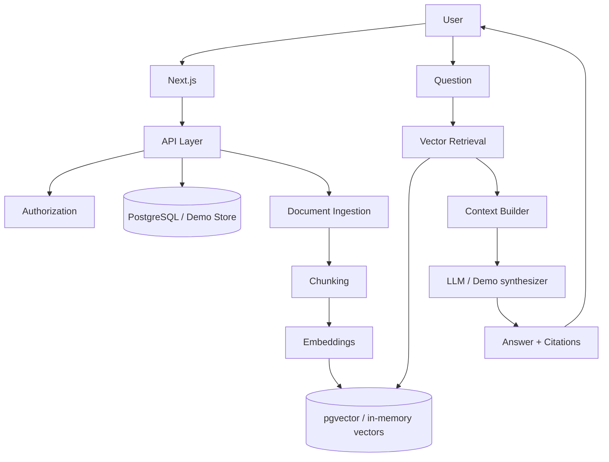
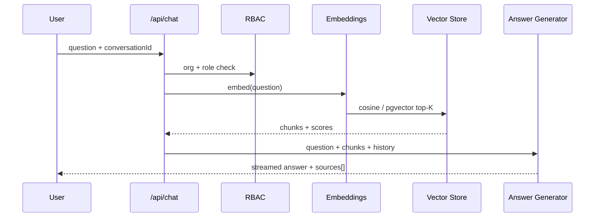
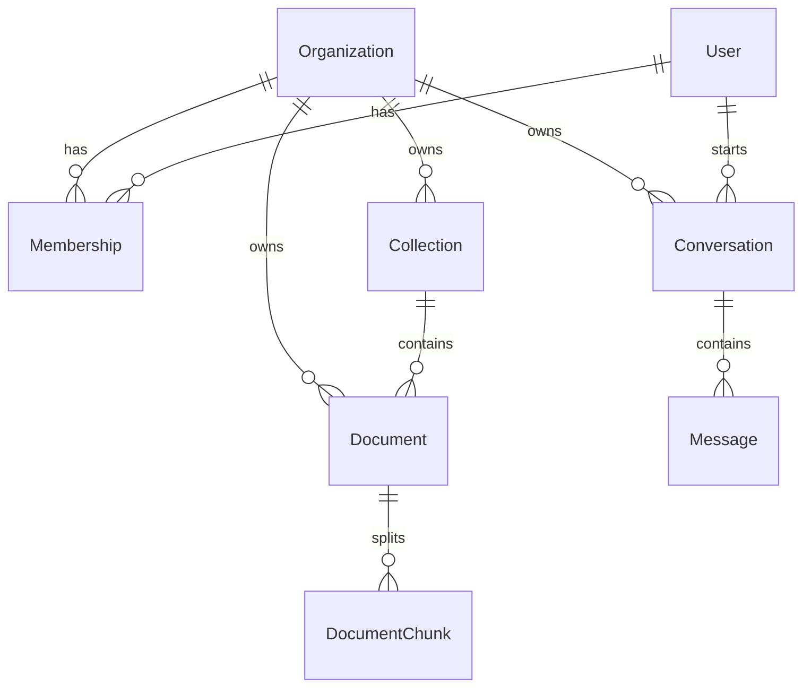
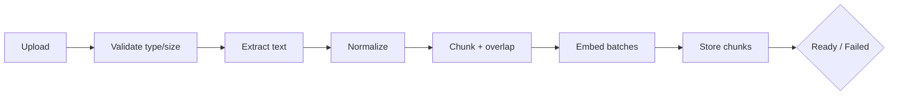

# KnowledgeHub AI

Enterprise internal knowledge platform with **retrieval-augmented generation (RAG)**. Organizations upload documentation, the system indexes it into vectors, and employees ask questions that are answered only from retrieved context — with citations.

> **Demo Mode is on by default.** The app works without OpenAI keys or Postgres. Local embeddings + extractive answering demonstrate the full RAG loop. The UI clearly labels Demo Mode and never pretends external AI was called.

---

## Overview

KnowledgeHub AI is a production-style multi-tenant SaaS knowledge hub:

- Upload PDF / TXT / Markdown into domain **collections**
- Run an ingestion pipeline: extract → normalize → chunk → embed → store
- Ask questions in an enterprise chat UI with streaming, sources, copy, regenerate
- Enforce organization membership and roles (Owner / Admin / Member)

It is designed to show serious AI engineering: grounding, citations, vector retrieval, authorization, validation, and a clear demo/production split.

---

## Why RAG

LLMs alone hallucinate company policy. RAG grounds answers in **your** documents:

1. Index documents offline into embeddings
2. At query time, retrieve the most similar chunks
3. Pass only those chunks to the model as context
4. Require citations back to source chunks

This reduces fabrication, improves auditability, and keeps answers organization-scoped.

---

## Features

- Multi-tenant org model with role-based authorization
- Document library with status (`Processing` / `Ready` / `Failed`) and chunk counts
- Collections: Engineering, HR, Operations, Product, Sales (+ custom)
- Semantic search inspector (see retrieved chunks + scores)
- Enterprise chat: history, streaming, citations, source panel, follow-ups
- Dashboard: documents, collections, questions, recent activity
- Demo Mode with seeded Acme Corp documentation
- Optional OpenAI embeddings + chat when keys are configured
- Zod validation, file type/size limits, server-side AI calls only

---

## Architecture



### Request path (chat)



---

## Multi-Tenancy

| Entity | Purpose |
|--------|---------|
| Organization | Tenant boundary |
| User | Identity |
| Membership | User ↔ Org with role |
| Collection | Domain partition of knowledge |
| Document | Uploaded file |
| DocumentChunk | Indexed unit of retrieval |
| Conversation / Message | Chat history |

**Roles**

| Role | Capabilities |
|------|----------------|
| Owner | Full control |
| Admin | Upload/delete documents, manage knowledge |
| Member | Ask questions, create collections, read |

All document, chunk, and conversation access is checked against `organizationId`.

---

## Database Schema

Prisma models live in `prisma/schema.prisma`. Production SQL (including **pgvector**) is in `prisma/migrations/0_init_pgvector/migration.sql`.



Key production detail:

```sql
embedding vector(1536)
CREATE INDEX ... USING hnsw (embedding vector_cosine_ops);
```

Demo Mode uses an in-memory `KnowledgeStore` with the same logical model and 384-d local embeddings.

---

## Document Pipeline



Supported uploads: **PDF**, **TXT**, **Markdown** (default max 10 MB).

Statuses: `PROCESSING` → `READY` or `FAILED` (with error message).

---

## Embedding Pipeline

| Mode | Provider | Notes |
|------|----------|-------|
| Demo | `local-hash-embedding-v1` | Deterministic hashed bag-of-tokens, L2-normalized |
| Production | OpenAI `text-embedding-3-small` | Server-side only via `OPENAI_API_KEY` |

Chunk metadata includes: `documentId`, `chunkIndex`, `content`, token/char estimates, embedding, document/collection names.

---

## Retrieval

1. Embed the user question
2. Score candidate chunks with **cosine similarity** (demo) or `<=>` distance (pgvector)
3. Filter/sort and return **top K** (default 5)
4. Build numbered context blocks `[1]…[K]` for the prompt

Org and optional collection filters always apply before ranking.

---

## Prompt Architecture

System rules enforce:

1. Answer only from provided context
2. Do not invent company policies
3. Say so when information is missing
4. Cite sources with `[n]` markers
5. Keep answers concise but useful

Demo Mode uses an **extractive synthesizer** over retrieved chunks (no external API). Production uses OpenAI chat with the same grounding prompt.

Response payload includes: `answer`, `sources[]`, `confidence`, `coverage`, `mode`, `model`.

---

## Security

- Organization-scoped authorization on every resource
- Role checks for uploads/deletes
- File extension + MIME allowlist
- Upload size limits
- Zod request validation
- Environment validation via Zod
- AI keys used only on the server — never sent to the client
- Demo Mode never claims live model calls occurred

---

## Tech Stack

| Layer | Stack |
|-------|--------|
| Frontend | Next.js 15, TypeScript, Tailwind CSS 4, Radix/shadcn-style UI |
| Backend | Next.js App Router API routes |
| Validation | Zod |
| AI | OpenAI embeddings + chat (optional) |
| Data | PostgreSQL + pgvector (prod schema) / in-memory store (demo) |
| Tests | Vitest |

---

## Setup

```bash
npm install
cp .env.example .env.local
npm run dev
```

Open [http://localhost:3000](http://localhost:3000) — you land on the dashboard with seeded Acme documentation.

### Production Postgres (optional)

1. Run Postgres with the `pgvector` extension
2. Apply `prisma/migrations/0_init_pgvector/migration.sql`
3. Set `DATABASE_URL`
4. Set `DEMO_MODE=false` and `OPENAI_API_KEY=...`

The demo store is the default runtime so the project is runnable without infrastructure. The SQL migration documents the production vector schema.

---

## Environment Variables

| Variable | Default | Description |
|----------|---------|-------------|
| `DEMO_MODE` | `true` | Force local embeddings + extractive answers |
| `OPENAI_API_KEY` | — | Enables live embeddings/chat when demo is off |
| `OPENAI_EMBEDDING_MODEL` | `text-embedding-3-small` | Embedding model |
| `OPENAI_CHAT_MODEL` | `gpt-4o-mini` | Chat model |
| `DATABASE_URL` | — | Postgres connection (production) |
| `MAX_UPLOAD_BYTES` | `10485760` | Upload size limit |
| `RETRIEVAL_TOP_K` | `5` | Chunks retrieved per question |
| `CHUNK_SIZE` | `800` | Target chunk character size |
| `CHUNK_OVERLAP` | `120` | Overlap between chunks |

---

## Demo Mode

Seeded tenant: **Acme Corporation** (user Alex Morgan, Owner).

Seeded collections & docs cover Engineering, HR, Operations, Product, and Sales (deployments, incidents, PTO, benefits, continuity, roadmap, sales playbook, security policy).

Demo Mode demonstrates:

- Semantic search with similarity scores
- Retrieval of the right policy chunks
- Grounded answers with `[n]` citations
- Clickable source panel showing the raw chunk

Banner copy is explicit: **Demo Mode — local retrieval, no external AI**.

---

## API

| Method | Path | Description |
|--------|------|-------------|
| `GET` | `/api/session` | Current user/org/role/mode |
| `GET` | `/api/dashboard` | Stats + recent activity |
| `GET/POST` | `/api/documents` | List / upload+ingest |
| `GET/DELETE` | `/api/documents/:id` | Detail+chunks / delete |
| `GET/POST` | `/api/collections` | List / create |
| `GET/POST` | `/api/conversations` | List / create |
| `GET/DELETE` | `/api/conversations/:id` | Messages / delete |
| `POST` | `/api/chat` | SSE streaming RAG answer |
| `POST` | `/api/search` | Semantic chunk search |
| `GET` | `/api/chunks/:id` | Fetch a source chunk |

Chat SSE events: `meta`, `token`, `done`, `error`.

---

## Testing

```bash
npm run lint
npm run typecheck
npm run test
npm run build
```

Coverage includes:

- Authorization / RBAC
- Chunking
- Retrieval ranking
- Prompt context construction
- Document ingestion pipeline
- Zod / upload validation

---

## Future Improvements

- Wire Prisma + pgvector repository behind the same store interface
- Real SSO (OIDC / SAML) and invitation flows
- Background job queue for large PDF ingestion
- Hybrid search (BM25 + vectors) and re-rankers
- Collection-level ACLs finer than org membership
- Evaluation harness (faithfulness / citation precision)
- Audit log export for enterprise compliance

---

## License

MIT — built as an advanced RAG reference application.
